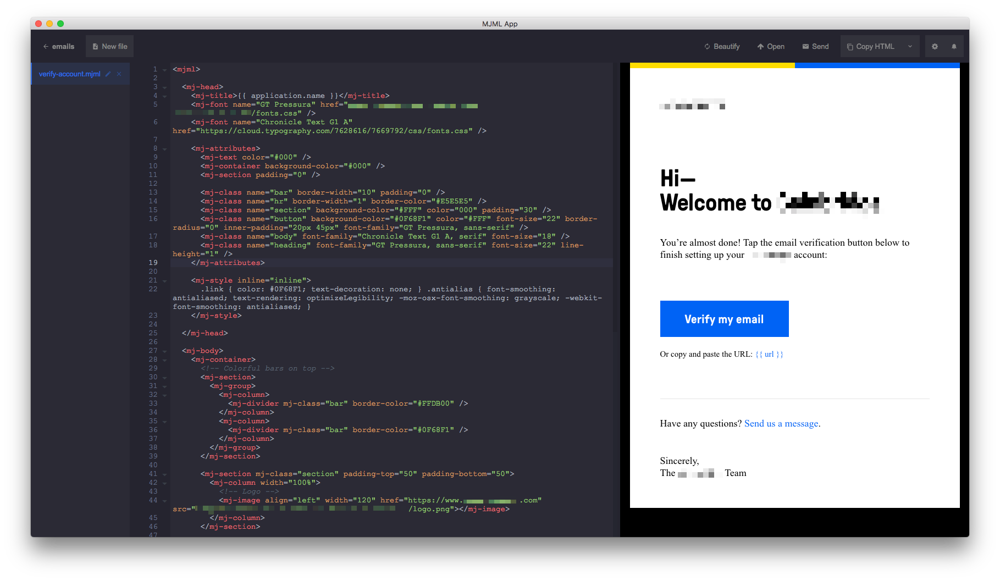

[awesome-emails]: https://github.com/jonathandion/awesome-emails
[back]: https://github.com/rafaelrinaldi/til/tree/master/misc
[cask]: https://caskroom.github.io
[docs]: https://mjml.io/documentation
[gui]: https://mjmlio.github.io/mjml-app
[mailjet]: http://mailjet.com
[mjml]: https://mjml.io

# MJML
>The simplest way of building responsive emails

Think of JSX or web components but for building responsive emails. That's exactly what [MJML][mjml] is.  

Super nice for when you have to build custom email templates but don't want to deal with hacky techniques for making things look consistent.

## Syntax

The language is fairly simple and comes with great primitives that will feel very familiar if you already know HTML.  

To name a few:

* `mj-text`
* `mj-button`
* `mj-image`

[They have great documentation with a lot of examples][docs].

## GUI

MJML comes as a CLI but there's also the option of using a [GUI][gui]. I find the GUI helpful because of features like code completion, code formatting and live preview.



I find the easiest way to get it is via [Cask][cask]:

```sh
brew cask install mjml
```

## Testing

The GUI also offers out of the box email testing via [Mailjet][mailjet] (the authors behind MJML). You can setup a free account and use it for testing purposes very fast.

You also have the option of using a different tool or service of your own liking.

## Related

- [Awesome emails][awesome-emails]

---

[← Back][back]
