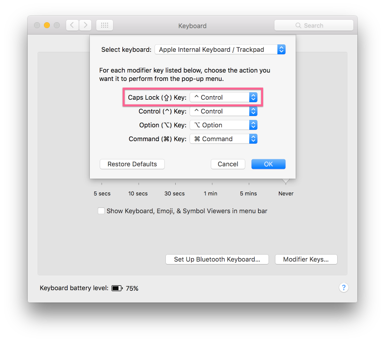

[back]: https://github.com/rafaelrinaldi/til/tree/master/tmux

# Caps Lock as prefix

Today I finally found a use for my retired Caps Lock key. I'm using it as my tmux prefix and it's working well so far!

First of all, make sure to report Caps Lock signal as if it was actually control. On a Mac, you can do that by going to System Preferences » Keyboard » Modifier Keys:



## No need to override the default `prefix`

People often unbind the default `prefix` key to be something else but this is not needed at all. You can simply set an optional prefix key with `prefix2`:

```
# Do not override default prefix, instead add another one
set -g prefix2 C-a
```

That's it, you can start using Caps Lock again.

---

[← Back][back]
