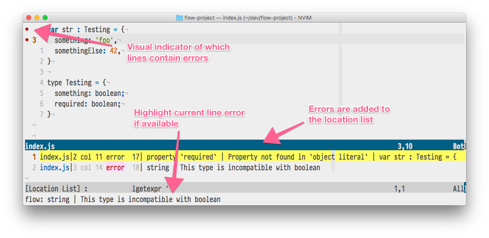

[back]: https://github.com/rafaelrinaldi/til/tree/master/vim
[flow-vim-quickfix]: https://github.com/ryyppy/flow-vim-quickfix
[flow]: http://flowtype.org
[neomake]: https://github.com/neomake/neomake
[nvim]: https://neovim.io
[vim]: http://www.vim.org/download.php

# Linting with [Flow][flow]

Recently I started working on a project where we use [Flow][flow] to type check our JavaScript code.

I used to dislike linting in Vim directly because purism and bad performance. But since Vim 8 came out, with support for asynchronous jobs I decided to give it a try and I really like the result so far.

## Requirements

- [Neomake][neomake] (use whatever plugin manager you want)
- Flow (either local or globally available)
- [Vim 8+][vim] (or [Neovim][nvim])

<sup>I'm not gonna get into details about anything other than Flow here but feel free to ping me with questions.</sup>

## Configuration

```viml
" Disable Flow linting through FB's plugin, delegate this to Neomake instead
let g:flow#enable = 0

" Tries to find Flow's binary locally, fallback to globally installed
if executable($PWD .'/node_modules/.bin/flow')
  let s:flow_path = $PWD .'/node_modules/.bin/flow'
else
  let s:flow_path = 'flow'
endif

" Custom maker that uses `flow-vim-quickfix` to improve the output
let s:flow_maker = {
    \ 'exe': 'sh',
    \ 'args': ['-c', s:flow_path.' --json --strip-root | flow-vim-quickfix'],
    \ 'errorformat': '%E%f:%l:%c\,%n: %m',
    \ 'cwd': '%:p:h'
    \ }

let s:neomake_makers = ['flow']

" I have to specify two makers because Neomake won't recognize `javascript.jsx`
let g:neomake_javascript_enabled_makers = s:neomake_makers
let g:neomake_jsx_enabled_makers = s:neomake_makers

" Same thing as above but this time to pass in the maker configuration
let g:neomake_javascript_flow_maker = s:flow_maker
let g:neomake_jsx_flow_maker = s:flow_maker

" Trigger linter whenever saving/reading a file
augroup NeomakeLinter
  autocmd!
  autocmd BufWritePost,BufReadPost * Neomake
augroup end
```

## Customization

By default Neomake will add icons to your Vim gutter to report errors and warnings. I personally prefer a simple bullet instead.

```viml
" All linting errors show be bullets
let g:neomake_error_sign = {'text': '•', 'texthl': 'NeomakeErrorSign'}
let g:neomake_warning_sign = {'text': '•', 'texthl': 'NeomakeWarningSign'}

" Prettier linting error colors
hi NeomakeErrorSign ctermfg=124 cterm=bold
hi NeomakeWarningSign ctermfg=31 cterm=bold
```

That's it! With this configuration in my place, this is how my Vim looks like:



## Credits

- [**@ryyppy**](https://github.com/ryyppy) for the pretty print plugin
- [**@ahmedelgabri**](https://github.com/ahmedelgabri) for the dynamic Flow path resolution idea

---

[← Back][back]
